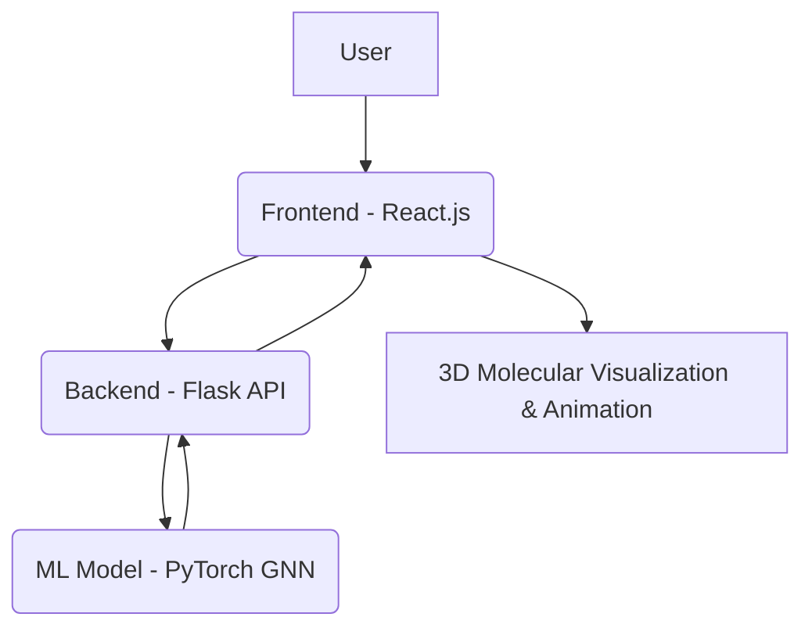

# 🚀 ChemStruct AI: Dynamic Molecular Visualization & Reaction Simulation

**Unlock the Dynamics of Molecules**  
ChemStruct AI is a cutting-edge web application built to help students and researchers intuitively explore molecular structures and their dynamic reactivity. By integrating 3D rendering and Graph Neural Networks (GNN), ChemStruct AI transforms static chemical data into interactive animated simulations.

---

## ✨ Problem Statement

Traditional chemical diagrams and tools often lack the dynamic, interactive feedback necessary for intuitive understanding. ChemStruct AI addresses this gap by offering a real-time visualization and reactivity prediction platform accessible through a web browser.

---

## 💡 Value Proposition

- **Enhanced Learning:** Makes chemistry engaging and accessible with real-time 3D animations.
- **Accelerated Research:** Fast, AI-powered predictions of reactive bonds for researchers.
- **Web Accessibility:** No need for heavy installations—just open in your browser.
- **High Engagement:** Visually stunning animations deliver the "wow" factor in education or demos.

---

## 🌟 Core Features (Hackathon MVP)

- 🔤 Input molecular formulas or **SMILES strings**
- 🔍 **Real-time 3D molecular visualization** with WebGL & Three.js
- 🧠 **AI-Powered Bond Reactivity Prediction** using Graph Neural Networks
- 🎬 **Animated Reaction Simulation** based on prediction
- 🎯 Predicted bond clearly **highlighted** in the 3D model and **displayed textually**
- 📱 **Mobile-responsive** design with a clean modern UI/UX

---

## 🛠️ Technical Stack

### Frontend
- **React.js** – Dynamic UI
- **Three.js / WebGL** – High-performance 3D rendering
- **HTML5 / CSS3** – Modern styling

### Backend
- **Flask (Python)** – REST API & ML orchestration
- **RDKit** – Molecular structure parsing & feature extraction

### Machine Learning
- **PyTorch / PyTorch Geometric** – GNN implementation
- **GNNs** – Reactivity prediction using molecular graphs

### APIs
- **PubChem** *(planned)* – Molecular data enrichment
- **Internal ML API** – Flask-based ML model inference

---

## 🧱 Architecture



Frontend: Handles input, displays 3D models, fetches ML predictions.
Backend: Serves ML predictions and data preprocessing.
ML Component: Predicts the most reactive bond using a trained GNN.
🧪 Installation & Local Setup (Mac / Unix)

Ensure you have Python ≥3.8 and Node.js ≥18 installed.
1️⃣ Clone the Repository
```bash
git clone https://github.com/Vaishakharekere/ChemStruct-AI.git
cd chemstruct_ai
```
2️⃣ ML Component Setup
cd chemstruct_ai_ml

# Create and activate virtual environment
```bash
python3 -m venv venv_ml
source venv_ml/bin/activate
 ```
# Install dependencies
```bash
pip install -r requirements.txt
```
# Train the model (creates gnn_bond_predictor.pth in /models)
```bash
python src/train.py
```
# Deactivate after training
```bash
deactivate
```
✅ A pre-trained model (gnn_bond_predictor.pth) may already be available in models/.
3️⃣ Backend Setup
```bash
cd ../chemstruct_ai_backend
```

# Create and activate virtual environment
```bash
python3 -m venv venv_backend
source venv_backend/bin/activate


# Install dependencies
pip install -r requirements.txt

# Ensure ML model file is in `models/` directory
# Start Flask backend
python app.py
The backend will run at: http://localhost:5000
4️⃣ Frontend Setup
cd ../chemstruct_ai_frontend

# Install Node dependencies
npm install

# Start the development server
npm start
```
The app will be live at: http://localhost:3000
Make sure the Flask backend is running first.
📂 Project Structure

chemstruct_ai/
├── chemstruct_ai_ml/           # GNN training & inference
│   ├── models/
│   ├── src/
│   └── requirements.txt
│
├── chemstruct_ai_backend/      # Flask API
│   ├── models/
│   ├── app.py
│   └── requirements.txt
│
├── chemstruct_ai_frontend/     # React.js frontend
│   ├── public/
│   ├── src/
│   └── package.json
🧠 Future Enhancements

🌐 Integrate PubChem API for live molecule validation and enrichment.
💾 Add user accounts and history via Firebase or Supabase.
🧪 Support full reaction simulations beyond single bond breaking.
📱 Native mobile app with React Nativ